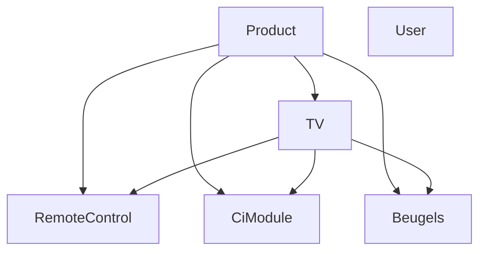
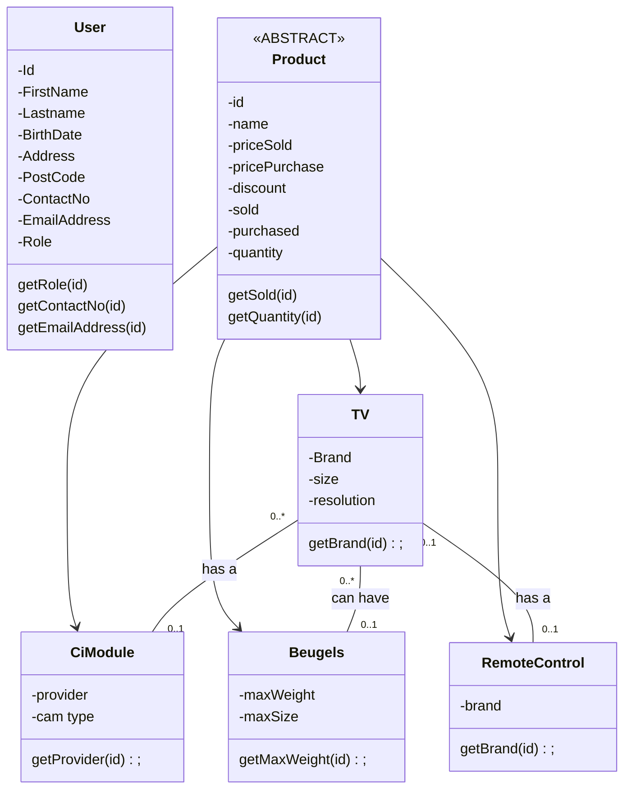

```mermaid
graph TD;
    
    Product-->TV;
    Product-->RemoteControl;
    Product-->CiModule;
    Product-->Beugels;


    TV-->RemoteControl;
    TV-->CiModule;
    TV-->Beugels;    
    
    User

```

```mermaid

    classDiagram


    class User {
        -Id
        -FirstName
        -Lastname
        -BirthDate
        -Address
        -PostCode
        -ContactNo
        -EmailAddress
        -Role
        
        getRole(id)
        getContactNo(id)
        getEmailAddress(id)
    }
    
    
    class Product {
        <<ABSTRACT>>
        -id
        -name
        -priceSold
        -pricePurchase
        -discount
        -sold
        -purchased
        -quantity
        
        getSold(id)
        getQuantity(id)

    }
    
    class TV {
        -Brand
        -size
        -resolution
        
        getBrand(id);
    }    
    
    class CiModule {
        -provider
        -cam type
        
        getProvider(id);
    }
    
    class Beugels {
        -maxWeight
        -maxSize   
        
        getMaxWeight(id);
    }
    
    class RemoteControl {
        -brand
        
        getBrand(id);
    }
    
    Product --> TV
    Product --> CiModule
    Product --> Beugels
    Product --> RemoteControl


    TV "0..*" -- "0..1" CiModule:has a
    TV "0..*" -- "0..1" Beugels:can have
    TV "0..1" -- "0..1" RemoteControl:has a    
```