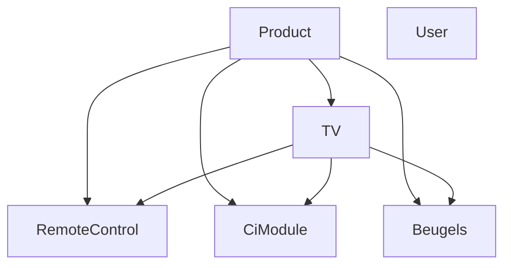
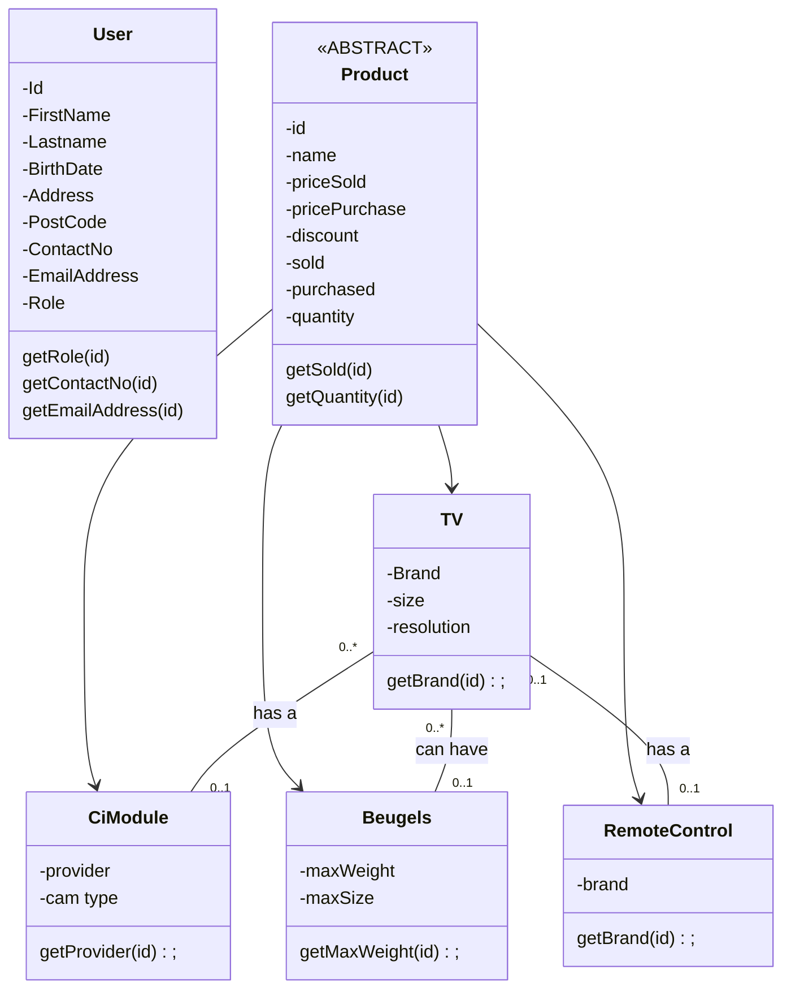

## **Functioneel eisen**

Als beheerder wil ik een overzicht van het product inkoop en kosten van inkoop.

Als beheerder wil ik een overzicht van het product verkoop en prijs van verkoop.

Als beheerder wil ik een overzicht van het aantal van het product en het aantal van inkoop.

Als gebruiker wil ik een overzicht van het aantal van product en het verkoop prijs.

Als gebruiker wil ik zien hoe is het product van elkaar verbind.

## Niet Functioneel eisen

Als gebruiker wil ik dat het applicatie snel draait.

Als gebruiker wil ik dat het applicatie altijd beschikbaar is.

Als gebruiker wil ik dat het applicatie op mijn telefoon kan gebruiken.

Als gebruiker wil ik dat het applicatie een dark mode kan stellen.

Als gebruiker wil ik dat het applicatie betrouwbaar is.

Als gebruiker wil ik dat het applicatie veilig is.

Als gebruiker wil ik dat het applicatie gebruikers vriendelijk is.

